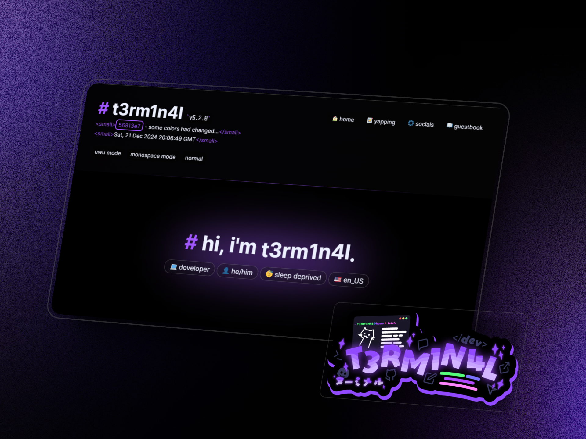

# t3rm1n4l's personal site

<a href="https://t3rm1n4l.dev">
  
</a>


Personal site/portfolio/blog, built with [Bun](https://bun.sh/) and [SCSS](https://tailwindcss.com/), and hosted on [Github Pages](https://hackclub.app/)! ft. aesthetic, and a responsive, mobile-friendly design. Built my own SSG to build the website to go with it!


## Development

1. Clone the source code to your device
```sh
git clone https://github.com/T3M1N4L/t3m1n4l.github.io
```

2. Install the project's dependencies
```sh
bun install
```

3. Build the static site to `/dist`
```sh
bun run build
```

The final website is **static**, and as such, it can be built and deployed on any static site hosting service, such as GitHub Pages/nekoweb. This repository contains the full source code.

### Notes
- Root file is `root.html` and specific pages `/src/pages/` under`.md`.
- Static-Site-Generator is located at `ssg.ts` and its configuration is located at `ssg.config.ts`. 
- Images are stored in `public/img`

### Roadmap
- [ ] astro rewrite
- [ ] better center gradient for the wavy `t3rm1n4l`
- [ ] clean up code especially css 
